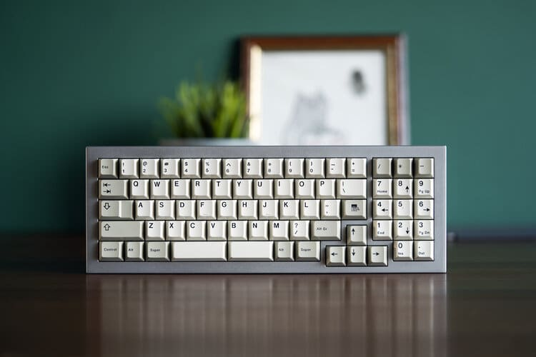

# AKB Raine

My humble beginnings.

* [Website](https://alchemistkeyboards.com/projects/keyboards/raine/)

## Specifications

* Sold in public group buy in June 2019. Sale limited to 25 units.
* Typing angle: 7°
* High profile, top-mounted design
* QMK Compatible PCB, designed by e11i0t23
* CNC 6061 Aluminium, bead-blasted and anodised
* 1.5mm Aluminium plate
* Top case options: WK & WKL
* Switch spacing: 19mm
* Front height: 20mm
* Unbuilt weight: 1.7kg (~3.75lbs)
